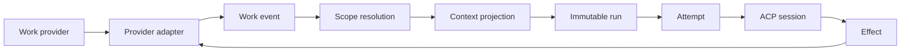

# OpenMatter

**The integration and context framework for work agents.**

> Context that puts agents to work, not another way to build them.

OpenMatter is an open, embeddable integration framework for bringing agents into chat, issue trackers, code hosts, kanban systems, forms, and scheduled work.

The core agent protocol is [Agent Client Protocol (ACP)](https://agentclientprotocol.com/get-started/introduction). OpenMatter does not replace or extend ACP transport. It provides the integration, scope, context, durable run, and effect runtime around an ACP agent.

> [!IMPORTANT]
> OpenMatter is at the design and framework setup stage. The API sketches below explain the intended developer experience; they are not yet a released compatibility promise.

## Why OpenMatter?

Agents already know how to reason, use tools, and generate results. Putting them into real work introduces a different set of problems:

- Which workspace, project, channel, thread, or work item does an event belong to?
- What context is relevant and authorized for this run?
- How can retries stay reproducible while source conversations keep changing?
- How should an agent reply, react, request approval, update a form, or mutate a work item?
- How can one application run with different providers, stores, agents, and deployment topologies?

OpenMatter makes those concerns explicit and programmable.

## Core flow



Every normalized event produces an explicit reaction. The reaction may be a reply, update, approval request, tool-backed effect, or a deliberate null effect.

## Integration first

The first OpenMatter milestone focuses on integrations. An integration is more than a webhook wrapper; it maps four surfaces between a work system and the framework:

| Surface | Responsibility |
| --- | --- |
| **Events** | Normalize messages, mentions, commands, forms, work-item changes, schedules, and callbacks into WorkEvent. |
| **Context** | Expose threads, records, files, boards, repositories, and other resources for authorized materialization. |
| **Effects** | Compile replies, reactions, forms, approvals, updates, and work mutations into provider API calls. |
| **Capabilities** | Declare supported operations, authentication requirements, permission scopes, and platform limits. |

Provider integrations should remain independently installable and testable against a shared harness. ACP remains the standard boundary to the agent on the other side.

## Framework sketch

OpenMatter is intended to feel like a framework, not a hosted control plane:

```ts
const app = defineOpenMatter({
  integrations: [chat, codeHost, kanban],
  store,
  queue,
  acp,

  scopes: {
    project: projectScope({ bindBy: ["repository", "channel", "board"] }),
    private: privateScope({ isolateBy: "actor" }),
  },

  routes: [
    when(messageMentioned())
      .useScopes("project", "thread")
      .collect(trigger(), recentThread(), referencedResources())
      .startRun(),

    when(schedule("*/15 * * * *"))
      .useScopes("project", "patrol")
      .collect(eventsSinceCursor(), openWorkItems())
      .startRun(),
  ],
});

await app.run();
```

Applications describe policy and context. OpenMatter performs the mechanical event, snapshot, attempt, and effect loop.

## Core model

| Concept | Meaning |
| --- | --- |
| **WorkEvent** | A normalized event from an IM, code host, kanban system, form, schedule, or custom source. |
| **AgentScope** | A user-defined boundary for resource bindings, context sources, policy, memory, and capabilities. |
| **ContextProjection** | The authorized, relevant, budgeted projection of active scopes for one run. |
| **Run** | A durable request with an immutable input and context snapshot. |
| **Attempt** | One disposable execution of a run. A retry creates a new attempt without silently changing the run input. |
| **Effect** | A structured outcome applied back to a provider, including an explicit null effect. |

## What OpenMatter is

- A framework for work-event ingestion, scope resolution, context engineering, durable runs, attempts, and effects.
- An integration runtime around ACP-compatible agents.
- A set of neutral interfaces, schemas, reference implementations, and a conformance harness.
- A library that can be embedded in infrastructure you own.

## What OpenMatter is not

- Not another model, prompt-chain, or agent-brain framework.
- Not a new agent wire protocol, replacement for ACP, or agent-internal tool loop.
- Not a required hosted hub, SaaS control plane, or central broker.
- Not tied to one IM, kanban product, database, queue, cloud, or deployment topology.

## Neutral by design

OpenMatter core depends on ports rather than infrastructure products:

- **WorkIntegration** supplies provider events, context resources, effects, capabilities, and auth.
- **ScopeResolver** selects active scopes for an event.
- **ContextProjector** collects, authorizes, filters, ranks, budgets, and snapshots context.
- **RunStore** persists scopes, runs, attempts, effects, leases, and audit records.
- **AttemptRunner** starts an ACP session for a frozen run context.
- **EffectDispatcher** applies idempotent outcomes to source systems.

An implementation may use memory, SQLite, Postgres, object storage, queues, or a custom durable backend. It may run as an embedded library, a single process, a sidecar, a worker service, a serverless function, or a distributed deployment.

## Relationship to agent frameworks

OpenMatter manages the work around an agent. The agent behind ACP may use any model or internal agent framework.

```text
Slack / Lark / Teams / GitHub / Kanban
                    |
               OpenMatter
                    |
                   ACP
                    |
       Claude / Codex / custom agent
       LangChain / LangGraph / other runtime
```

## Documentation

- [Product and architecture brief](docs/BRIEF.md)
- API reference, integrations, deployment guides, and examples will arrive with the first executable release.

## Initial direction

The integration-first milestone is expected to include:

- an integration contract covering Events, Context, Effects, and Capabilities;
- an ACP client binding as the standard agent boundary;
- one complete reference work-system integration;
- a harness for provider capability, idempotency, and effect behavior;
- neutral schemas for events, scopes, context, runs, attempts, and effects;
- an in-memory runtime plus storage and deployment ports.

OpenMatter is being designed in the open. The repository will evolve from this brief into executable schemas, adapters, and a stable runtime.
