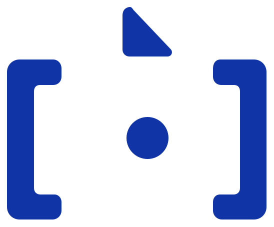
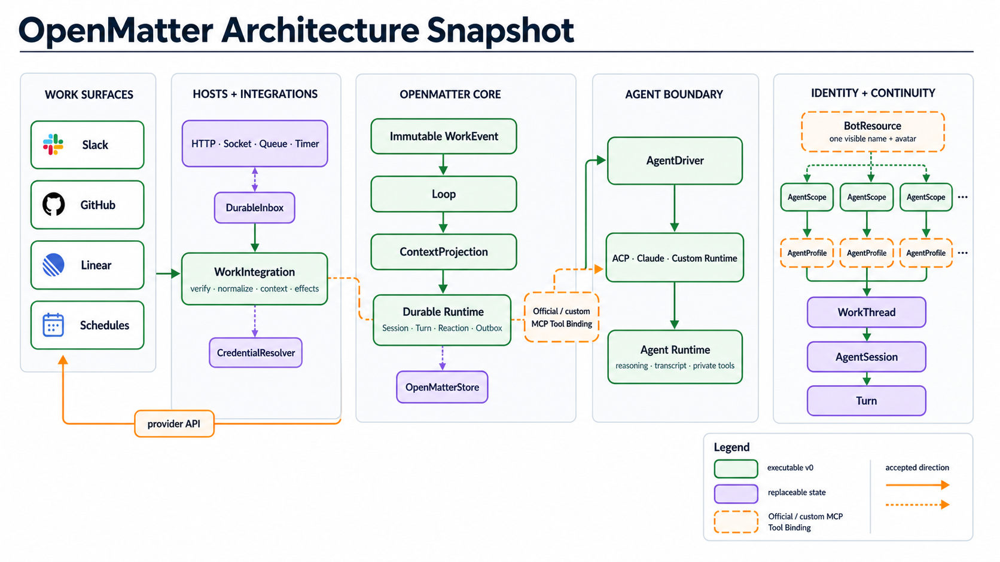

<p align="center">
  
</p>

<h1 align="center">OpenMatter</h1>

<p align="center">
  <strong>Durable agent loops for work systems.</strong><br />
  Connect work-platform events to replaceable agents while keeping context,
  authority, continuity, and side effects explicit.
</p>

<p align="center">
  <a href="https://matter.openma.dev/doc/">Documentation</a> ·
  <a href="https://matter.openma.dev/doc/quickstart/">Quickstart</a> ·
  <a href="docs/ARCHITECTURE_SNAPSHOT.md">Architecture</a> ·
  <a href="docs/LOOPS.md">Loops</a>
</p>

---

OpenMatter is an open, embeddable TypeScript framework for keeping agents
present in Slack, GitHub, Linear, and other work systems.

A **Loop** is a built-in or user-defined process that repeatedly turns
subscribed work events into terminal Reactions. The application decides what
context an agent receives and which operations it may use; the agent retains
the reasoning.

> Compile APIs and events. Keep context and policy in your application. Leave
> the mind to the agent.

## The shape

```text
work platform                                                work platform
     │                                                            ▲
     │ native event                                     approved effect
     ▼                                                            │
WorkIntegration ──▶ WorkEvent ──▶ Loop ──▶ ContextProjection     │
                                      │                            │
                                      ▼                            │
                               Agent Session ──▶ Turn ──▶ Reaction
                                      ▲                    │
                                      │                    ▼
                                  AgentDriver         durable outbox
```

Every domain-complete accepted `WorkEvent` reaches one immutable terminal
`Reaction`, including the explicit no-op case. Infrastructure failures remain
recoverable instead of being misreported as domain outcomes.

[](docs/ARCHITECTURE_SNAPSHOT.md)

## Why OpenMatter

- **The Loop is the product boundary.** Activation, context, continuity,
  permissions, reactions, and recovery compose in one reusable process.
- **Agents remain replaceable.** `AgentDriver` connects durable Sessions and
  Turns to ACP-compatible connectors, managed runtimes, in-process SDKs, or
  custom agents.
- **Work systems remain replaceable.** `WorkIntegration` normalizes provider
  events, Context readers, and a finite set of explicitly granted Effects.
- **Durability is structural.** Events, ContextProjections, Turn inputs,
  permission decisions, Reactions, Effects, and delivery receipts are portable
  immutable facts. Leases and fenced writes handle retries and stale workers.
- **Deployment stays yours.** OpenMatter owns no mandatory server, queue,
  scheduler, database, credential service, Hub, or SaaS control plane.

## Run the executable example

The repository targets Node.js 22.5+, TypeScript 6, and Effect 3.

```sh
git clone https://github.com/openma-ai/OpenMatter.git
cd OpenMatter
pnpm install
pnpm check
pnpm --filter @openmatter/example-basic build
pnpm --filter @openmatter/example-basic start
```

The basic example uses the Memory Store and mock adapters, then executes the
same Event → Context → Session → Turn → Reaction lifecycle used by real
integrations. See
[`examples/basic/src/index.ts`](examples/basic/src/index.ts) for the complete
runnable composition.

## Define a Loop

`defineLoop()` keeps a portable, JSON-safe definition next to executable
TypeScript. The definition can be inspected, versioned, generated, and later
visualized without pretending arbitrary application logic is serializable.

```ts
import { defineLoop } from "@openmatter/runtime";

const issueTriage = defineLoop(
  {
    id: "issue-triage",
    version: "0.1.0",
    spec: {
      sources: ["linear.issue.updated"],
      workThread: "linear.issue",
      session: "per-work-thread",
    },
  },
  (loop) =>
    loop.on("linear.issue.updated", (work) =>
      work.react.none("No action required"),
    ),
);

app.loop(issueTriage);
```

`app.loop()` installs into the same runtime kernel as the low-level `app.on()`
API. OpenMatter does not add a second graph executor, Actor DSL, or hidden
scheduler.

For Slack, the built-in `claudeTag()` Loop already defines mention, direct
message, slash-command, Scope, WorkThread, Session, and reply behavior:

```ts
import { claudeTag } from "@openmatter/orchestration";

app.loop(
  claudeTag({
    agentId: "claude",
    commandVisibility: "ephemeral",
  }),
);
```

See the [Claude Tag guide](https://matter.openma.dev/doc/orchestration/claude-tag/)
for the complete composition.

## What belongs where

| OpenMatter owns                        | The agent owns                       | The host application owns          |
| -------------------------------------- | ------------------------------------ | ---------------------------------- |
| Event normalization and subscription   | Reasoning and planning               | Server/process lifecycle           |
| Scope and WorkThread association       | Private transcript and scratch state | Credential acquisition and storage |
| Authorized ContextProjection           | Internal tool-use sequence           | Queue and scheduler registration   |
| Agent Session continuity policy        | Model/runtime implementation         | Product-specific policy and UI     |
| Operation grants and terminal Reaction | How to satisfy the Turn              | Deployment and observability       |
| Durable Effect intents and recovery    |                                      |                                    |

This boundary is deliberate: OpenMatter orchestrates **what the agent sees,
when it runs, what continuity it receives, and what it may do**—not how it
thinks.

## Work integrations

The shipped integrations follow the same SDK shape: signed ingress, standard
WorkEvents, authority-scoped credentials, explicit Context readers, and a
finite operation allowlist.

| Integration | Credential authority        | Context and Effects                                                                                       |
| ----------- | --------------------------- | --------------------------------------------------------------------------------------------------------- |
| **Slack**   | installation workspace/team | Message, thread, conversation, and user Context; replies, reactions, ephemeral messages, views, and files |
| **GitHub**  | GitHub App installation     | Repository, issue, pull request, review, workflow; comments, reactions, reviews, merge, and dispatch      |
| **Linear**  | organization/workspace      | Issue, comments, project, document; issue, comment, project, and document mutations                       |

Provider-native payloads remain available as recursively sanitized JSON.
Arbitrary REST or GraphQL calls are not smuggled through a generic operation.
Application policy decides which advertised capabilities enter a
`ContextProjection.grants` list.

## Replaceable boundaries

| Boundary        | Contract             | Included adapters                                                                      |
| --------------- | -------------------- | -------------------------------------------------------------------------------------- |
| Work platform   | `WorkIntegration`    | Slack, GitHub, Linear, mock                                                            |
| Agent runtime   | `AgentDriver`        | `OpenMAAgentConnector` bridge, mock, custom drivers                                    |
| Durable state   | `OpenMatterStore`    | Memory reference adapter; production adapters remain application choices               |
| Credentials     | `CredentialResolver` | Static/example sources; environment, vault, OAuth, or control plane remain replaceable |
| HTTP framework  | `HttpEndpoint`       | Fastify and Hono components                                                            |
| Host lifecycle  | application boundary | Cloudflare Queue host and local Slack Socket Mode host                                 |
| Durable ingress | `DurableInbox`       | Embedded SQLite adapter for local Node                                                 |

ACP and managed-agent wire events are normalized by the pinned
`@openma/common` contract into one deeply immutable `OpenMAEvent` stream. The
Effect-native bridge does not duplicate the event vocabulary or implement
another managed-agent SaaS runtime.

## Deploy without changing the Loop

The same Slack application and `claudeTag()` Loop can run in two included host
shapes:

- **Cloudflare Workers + Queues** — signed HTTP ingress is acknowledged after
  durable enqueue; a Queue consumer runs the application. Scheduled Effect
  recovery remains an explicit host entry point.
- **Local Node + Socket Mode** — no public webhook URL is required. Native
  envelopes enter a `DurableInbox` before acknowledgement; the SQLite adapter
  supplies embedded ingress durability.

Fastify and Hono components mount provider-neutral `HttpEndpoint` values when
the user owns the server. A scheduler is just another source adapter:
Cloudflare Cron, EventBridge, Kubernetes CronJob, or a Node timer emits a
WorkEvent and the same Loop handles it.

See the [deployment guide](https://matter.openma.dev/doc/operate/deployment/),
[`examples/slack-cloudflare`](examples/slack-cloudflare/src/index.ts), and
[`examples/slack-local`](examples/slack-local/src/index.ts).

## One visible bot, many work profiles

A Slack bot name and avatar identify the visible `BotResource`; they do not
define one universal personality. Multiple Scope bindings beneath the same bot
may select different versioned AgentProfiles, context policies, memory
namespaces, and execution credentials.

```text
BotResource / SurfaceIdentity
└── ScopeBinding
    ├── AgentScope                  shared policy and authority
    ├── AgentProfile revision       runtime, role, prompt, style
    ├── ExecutionIdentity           bot, app, or delegated principal
    └── WorkThread
        └── AgentSession → Turn     runtime continuity and invocation
```

Visible authorship, behavior, and execution credentials never select each
other implicitly. Read the [identity model](docs/IDENTITY_MODEL.md).

## Packages

| Group              | Packages                                                                      |
| ------------------ | ----------------------------------------------------------------------------- |
| Foundation         | `@openmatter/core`, `store`, `integration`, `agent`, `runtime`, `credentials` |
| Reference adapters | `store-memory`, `integration-mock`, `agent-mock`                              |
| Work platforms     | `integration-slack`, `integration-github`, `integration-linear`               |
| Agent bridge       | `agent-claude`                                                                |
| Orchestration      | `orchestration`                                                               |
| HTTP and hosts     | `http`, `fastify`, `hono`, `host-cloudflare`, `host-local`                    |
| Ingress durability | `inbox`, `inbox-sqlite`                                                       |

The dependency direction and ownership of every package are documented in
[Project structure](docs/PROJECT_STRUCTURE.md).

## What OpenMatter is not

- Not another agent brain, prompt graph, planner, or model SDK.
- Not a replacement for ACP, MCP, OpenAPI, AsyncAPI, or GraphQL.
- Not a mandatory Hub, SaaS control plane, database, queue, scheduler, or
  credential service.
- Not a generic arbitrary-provider API proxy.
- Not a closed JSON workflow language.

OpenAPI and future Work Profiles may reduce integration authoring, but provider
semantics, authority, risk, and resource identity cannot be inferred safely
from an API schema alone.

## Status

OpenMatter currently ships an executable **v0 vertical slice**. Contracts are
pre-stable while they are exercised by production-grade Store adapters, Agent
connectors, integrations, and a conformance harness.

The foundation already includes:

- Effect Schema domain contracts and Effect Service/Layer ports;
- immutable ContextProjections with provenance, grants, and digests;
- authority/privacy-bound Agent Sessions and validated OpenMAEvent streams;
- leased Event, Session, and Effect claims with heartbeat renewal and fencing;
- stable logical Turns, checkpointed streams, and durable permission decisions;
- insert-once terminal Reactions and recoverable Effect delivery receipts.

## Read next

- [Documentation site](https://matter.openma.dev/doc/)
- [Quickstart](https://matter.openma.dev/doc/quickstart/)
- [Architecture snapshot](docs/ARCHITECTURE_SNAPSHOT.md)
- [Runtime architecture](docs/RUNTIME_ARCHITECTURE.md)
- [Domain model](docs/DOMAIN_MODEL.md)
- [Loops](docs/LOOPS.md)
- [SDK shape](docs/SDK_SHAPE.md)
- [Integrations](docs/INTEGRATIONS.md)
- [Credentials](docs/CREDENTIALS.md)
- [Agent runtime](docs/AGENT_RUNTIME.md)
- [Design decisions](docs/DECISIONS.md)

## Development

```sh
pnpm install
pnpm check
```

`pnpm check` formats, tests, type-checks, and builds the complete workspace.
