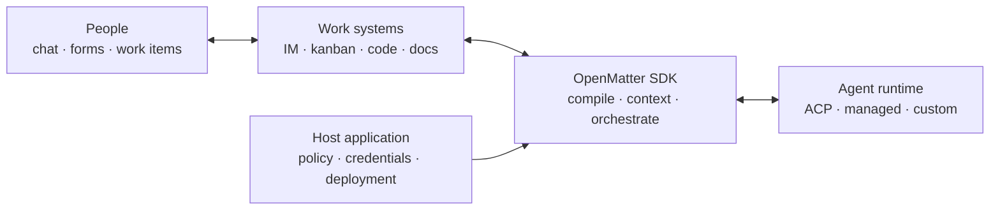
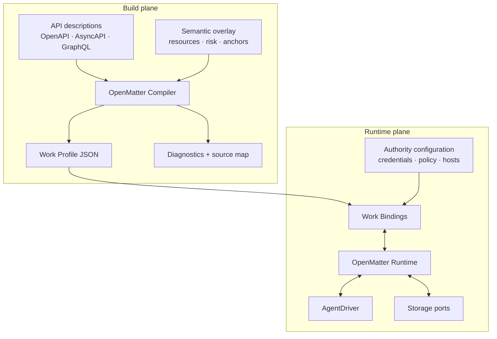
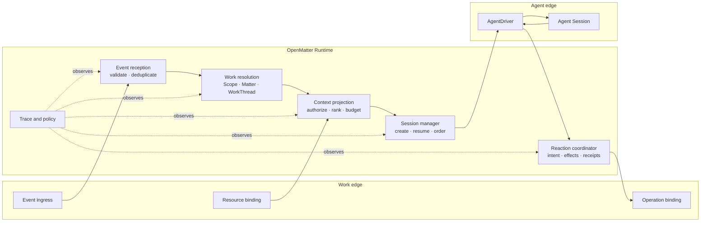
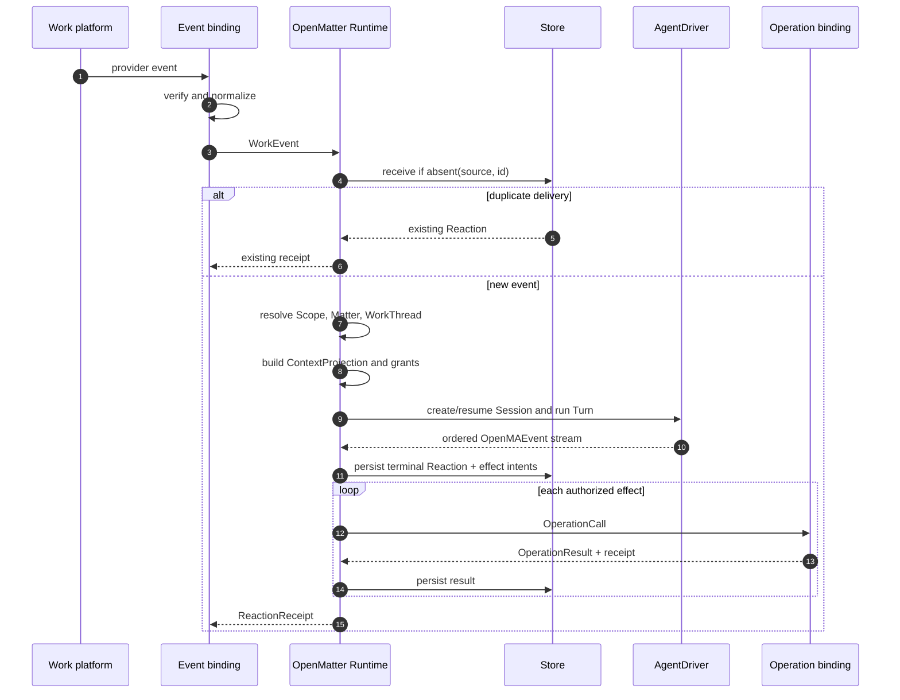
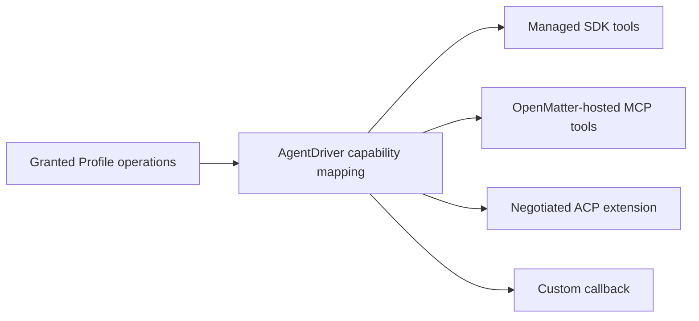
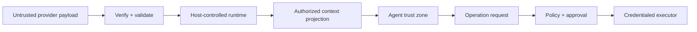

# OpenMatter Architecture v0

| Field  | Value                                 |
| ------ | ------------------------------------- |
| Status | Directional Work Profile architecture |

This document describes the intended Work Profile/compiler layer. The shipped executable contract is the Effect runtime in [Runtime Architecture](./RUNTIME_ARCHITECTURE.md); the compiler remains future work.

## 1. Architectural statement

OpenMatter is an embeddable SDK that compiles work-system descriptions into portable Work Profiles and uses those Profiles to place an external agent into a governed work loop.

It has two replaceable edges:

- **Work edge:** Profile plus bindings for events, resources, and operations.
- **Agent edge:** `AgentDriver` for ACP, a managed agent runtime, or a custom SDK.

OpenMatter owns the orchestration and context between those edges. It does not own the agent's reasoning and does not require a central service.

## 2. System context



The Host application chooses which events matter, what authority applies, which context is disclosed, which operations are exposed, and how the final Reaction is delivered.

## 3. Two planes

OpenMatter separates build-time description from runtime execution.



The Work Profile crosses the planes. Credentials and executable functions do not.

## 4. Runtime components



### 4.1 Profile Registry

Loads immutable Work Profiles, verifies supported schema versions and bindings, and indexes definitions by Profile ID and version.

### 4.2 Authority Registry

Binds a Profile to a concrete provider installation. It resolves credentials, trusted hosts, provider scopes, rate policy, and event bindings.

### 4.3 Event Reception

Validates WorkEvents, records reception, deduplicates redelivery, and ensures every valid event reaches a terminal Reaction.

### 4.4 Work Resolution

Maps an event to application governance and continuity:

```text
WorkEvent → AgentScope → Matter links → WorkThread
```

Profile Resource addresses and anchors provide evidence. Application policy makes the final Scope and WorkThread decision.

### 4.5 Context Projection

Collects candidate context and creates the immutable, authorized snapshot for one Turn:

```text
collect → authorize → filter → materialize → rank → budget → snapshot
```

The agent never receives raw credentials or unapproved provider data merely because a Profile can address it.

### 4.6 Session Manager

Maps the WorkThread to an external Agent Session according to application policy. A Session is normally keyed by:

```text
agent + runtime authority + AgentScope + WorkThread + privacy partition
```

The Session is runtime continuity, not the durable source of business truth.

### 4.7 Reaction Coordinator

Turns the terminal agent outcome into one Reaction, persists operation intents, executes authorized effects, and records receipts. `effects: []` is an explicit null Reaction.

## 5. Reactive event sequence



The durable write before effect execution prevents an acknowledged event from losing its intended outbound work. Provider-level exactly-once behavior still depends on provider idempotency support.

## 6. Proactive work sequence

Proactive behavior uses the same event path.


The scheduler is not an Agent and a proactive Agent is not a special domain
type. OpenMatter does not register or wake schedules. A decoded tick may reuse a
named WorkThread and Agent Session or request fresh continuity.

## 7. Ownership boundaries

| Concern                      | Work Profile          | Host application         | OpenMatter Runtime                   | Agent runtime               |
| ---------------------------- | --------------------- | ------------------------ | ------------------------------------ | --------------------------- |
| API input/output schema      | Defines               | May extend               | Validates                            | Consumes exposed view       |
| Provider operation mechanics | References binding    | Configures authority     | Invokes binding                      | Requests operation          |
| Credentials                  | Declares requirement  | Owns values              | Resolves by policy                   | Never receives raw value    |
| Event shape                  | Defines               | Configures ingress       | Validates and deduplicates           | Receives context projection |
| Resource identity evidence   | Defines selectors     | May resolve custom forms | Preserves and links                  | May propose links           |
| AgentScope                   | Provides hints only   | Defines policy           | Resolves and records                 | Does not own                |
| WorkThread                   | Provides anchors only | Defines policy           | Creates or continues                 | Receives continuity context |
| Session internals            | No                    | Chooses reuse policy     | Stores external binding              | Owns transcript/scratchpad  |
| Reasoning and planning       | No                    | Chooses agent            | No                                   | Owns                        |
| Reaction completeness        | Defines record        | May customize compiler   | Enforces exactly one terminal result | Supplies outcome/events     |
| External effects             | Defines operations    | Authorizes               | Coordinates and audits               | Requests                    |

This table is normative architecture guidance: a Profile must not become executable application policy, and an Agent Session must not become the only place durable work truth exists.

## 8. Work Profile versus application policy

A Work Profile answers:

- What can this work surface expose?
- What schemas and provider bindings exist?
- What Resource and safety semantics are known?

Application code answers:

- Should this event activate this agent?
- Which AgentScope and WorkThread apply?
- What context may this actor and agent see?
- Which operations are granted for this Turn?
- Is approval required now?

```ts
app.on("issue.updated", async (work) => {
  const scope = await work.scopes.resolve(resolveProjectScope);
  const thread = await work.threads.continue(resolveIssueThread);

  const context = await work.context.project({
    scope,
    thread,
    event: work.event,
  });

  const result = await work
    .agent("worker")
    .session({
      scope,
      thread,
    })
    .turn({
      context,
      allow: ["issue.read", "issue.comment.create"],
    });

  return work.react(result);
});
```

The handler is code. Its inputs, decisions, records, and effects are observable JSON.

## 9. Agent-side operation delivery

Work Profile operations are not coupled to one agent tool protocol.



The driver advertises what it supports. If an ACP implementation cannot receive dynamic client tools, OpenMatter can expose the operations through an attached MCP server or a runtime-specific adapter. This is a binding decision, not a change to Work Profile identity.

## 10. Persistence model

OpenMatter persists only state required for correctness, recovery, continuity, and audit.

```text
Profile metadata and authority bindings
WorkEvent reception and deduplication
AgentScope revisions
Matter identities and links
WorkThread revisions and anchors
ContextProjection digests and provenance
AgentSession external handles
Turn and OpenMAEvent state
Reaction and operation intents
Operation results and provider receipts
Schedule checkpoints and leases
```

Agent transcript, scratchpad, model cache, and private tool state may remain opaque in the Agent runtime.

### 10.1 Required consistency

The storage adapter must provide equivalent behavior for:

- insert-if-absent event reception;
- compare-and-set revisions;
- terminal-state uniqueness;
- atomic Reaction plus effect-intent persistence;
- recoverable leases;
- idempotency-key lookup.

This may be implemented with SQL transactions, an event log, durable objects, compare-and-set document storage, or another mechanism.

## 11. Deployment shapes

### 11.1 Embedded process

```text
application process
├── HTTP/webhook routes
├── OpenMatter Runtime
├── in-memory or local durable adapter
└── ACP/managed-agent client
```

Best for development, bots, plugins, and a single authority.

### 11.2 Serverless ingress

```text
provider webhook → verify → durable host queue {native event / WorkEvent}
                                      ↓
                       worker → app.acceptFrom / app.accept
```

The ingress function acknowledges provider delivery only after its host queue
accepts the job. It does not start hidden background work after returning the
HTTP response.

### 11.3 Ingress plus workers

```text
webhooks / sockets / pollers / host timers
            ↓
      durable host queue
            ↓
    WorkIntegration.ingest
            ↓
    createOpenMatter.accept
            ↓
    durable effect outbox
            ↓
 WorkIntegration.deliver
```

Workers coordinate through storage leases and WorkThread/Session ordering keys.
The same `accept` program is safe to invoke from request handlers, queue workers,
or a long-lived consumer. No OpenMatter-hosted Hub or deployment runtime is
required.

### 11.4 Sidecar or remote binding

A Work Binding may run remotely when credentials, network placement, or a chosen integration platform require it. The core remains embeddable; remote execution is one deployment option, not a semantic dependency.

## 12. Security architecture

### 12.1 Trust zones



The Agent is not assumed to be a trusted holder of provider credentials.

### 12.2 Required controls

- webhook authenticity verification before normalization;
- strict schema and payload-size validation;
- authority-scoped credential resolution;
- trusted server allowlists and redirect policy;
- per-Turn operation grants;
- confirmation floors for destructive operations;
- idempotency and unknown-outcome handling;
- secret and interaction-token redaction;
- context provenance and access decisions;
- audit linkage from WorkEvent through Turn to OperationResult.

### 12.3 Prompt injection boundary

Provider content is untrusted data even when it comes from an authorized resource. Context items retain origin and content type. Provider text never changes operation grants, credential selection, trusted hosts, or system policy merely through instructions embedded in content.

## 13. Scaling and ordering

The natural concurrency key is normally WorkThread or AgentSession, not Channel and not global process.

- different WorkThreads can run in parallel;
- events for one non-concurrent AgentSession are ordered;
- operations use their own idempotency keys;
- provider rate limits are scoped by authority and operation group;
- event ordering is best-effort unless a binding supplies an ordering key;
- late events remain observable and may be ignored with a null Reaction.

Backpressure belongs at event ingress and work queues. Agent token streaming does not block unrelated WorkThreads.

## 14. Observability

Every accepted event has one correlation chain:

```text
WorkEvent
  → ScopeResolution
  → MatterResolution
  → WorkThreadDecision
  → ContextProjection
  → AgentSession / Turn
  → OpenMAEvent stream
  → Reaction
  → OperationCall / OperationResult
```

Traces record decisions at SDK boundaries. Arbitrary user code appears as an instrumented custom step when it supplies a manifest, or as an opaque code step otherwise.

Required identifiers propagate across logs and traces:

```text
event source + event id
scope id
work thread id
session id
turn id
reaction id
operation call id
provider request id
```

## 15. Failure and recovery

| Failure                               | Required behavior                                                               |
| ------------------------------------- | ------------------------------------------------------------------------------- |
| Invalid provider delivery             | Reject before WorkEvent reception; record delivery diagnostic.                  |
| Duplicate WorkEvent                   | Return existing terminal state or continue the same in-flight state.            |
| Scope or context denied               | Produce terminal null or failed Reaction according to policy.                   |
| Agent stream interrupted              | Mark Turn interrupted; resume or retry only by driver capability and policy.    |
| Process stops before effect execution | Recover persisted effect intent.                                                |
| Process stops during write            | Resolve by provider receipt/idempotency; otherwise mark unknown.                |
| Callback token expires                | Return expired/failed operation result; do not reinterpret as durable identity. |
| Profile version unavailable           | Stop affected authority and surface capability/configuration failure.           |
| Binding lacks a feature               | Advertise unsupported capability; do not silently approximate.                  |

## 16. Evolution path

### v0: prove the boundary

- Work Profile schema;
- OpenAPI operation compiler;
- generic HTTP binding;
- event acceptance and terminal Reaction;
- in-memory store;
- fake then ACP AgentDriver;
- black-box harness.

### v0.x: prove work semantics

- AsyncAPI and webhook bindings;
- Resource extraction and Matter linking;
- commands/forms;
- durable reference store;
- proactive schedules;
- one IM and one work-tracker example.

### v1 candidate: independent implementation contract

Only after independent profiles or bindings exist should OpenMatter stabilize:

- Profile compatibility rules;
- binding capability negotiation;
- conformance levels;
- durable state behavior;
- optional network bindings, if real deployments require them.

Until then, OpenMatter is deliberately an SDK with portable artifacts rather than a newly branded wire protocol.
