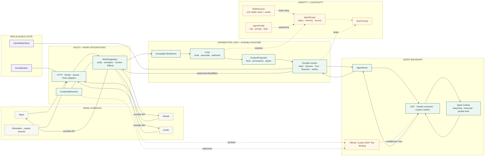

# Architecture Snapshot

**Snapshot:** 2026-08-24
**Scope:** executable v0 plus accepted identity and tool-binding decisions


The generated image is the presentation view. The Mermaid graph below is the
normative relationship map when visual routing is ambiguous.

Solid arrows show the executable v0 path. Dashed boxes or arrows show accepted
architecture that is not yet a complete public API.



## Reading the snapshot

The main executable flow is:

```text
native event
→ Host / WorkIntegration
→ immutable WorkEvent
→ Loop resolves Scope and WorkThread
→ authorized ContextProjection
→ durable Agent Session and Turn
→ AgentDriver / ACP or managed connector
→ terminal Reaction and authorized WorkEffects
→ provider delivery
```

OpenMatter owns work-side context, authority, continuity, recovery, and
effects. The Agent runtime owns reasoning, transcript, planning, and private
tool state. Hosts own transport lifecycle. Stores, credentials, agent runtimes,
and deployments remain replaceable.

The accepted identity model keeps one provider-visible BotResource while
allowing many AgentScopes and versioned AgentProfiles beneath it. Official and
custom MCP Tool Binding is the remaining bridge for exposing granted work
capabilities to Agent runtimes without reimplementing each provider's complete
API.
