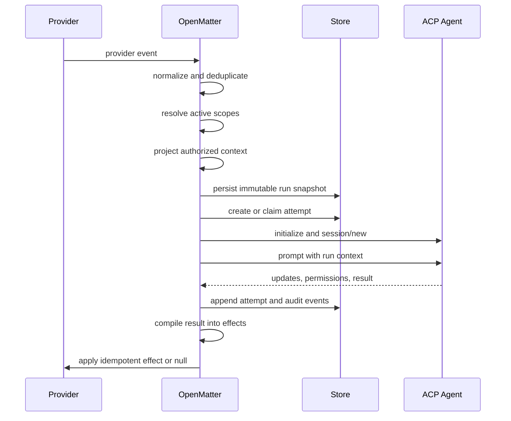

# OpenMatter: Product and Architecture Brief

| Field | Value |
| --- | --- |
| Status | Initial design brief |
| Category | Work-agent integration and context runtime framework |
| Agent boundary | Agent Client Protocol (ACP) |

## Product statement

OpenMatter is an open, embeddable integration framework that connects ACP agents to real work systems and turns their events into scoped, governed, and reproducible runs.

It provides the runtime around an agent rather than another way to build the agent itself. Applications use OpenMatter to describe:

- when an event should activate an agent;
- which scopes apply;
- what context may be collected and projected;
- what permissions are effective for the run;
- how a durable run becomes one or more disposable attempts;
- which structured effect, including no effect, is returned to the source system.

## The problem

Connecting an agent to an IM webhook is easy. Operating a work agent safely over time is not.

Work is distributed across channels, threads, repositories, tickets, boards, forms, files, and scheduled processes. An agent must see enough information to act without inheriting every conversation or credential. A retry should not silently receive a different input. Provider callbacks must be idempotent. Permissions must follow the actor, scope, surface, and approval state. Deployments must survive process restarts without requiring a vendor-controlled hub.

These concerns sit outside the model and the agent's internal reasoning loop. OpenMatter makes them first-class framework concepts.

## Positioning

```text
Work systems             OpenMatter                    Agent

events and callbacks  -> scope and context runtime -> ACP session
effects and updates   <- durable run lifecycle     <- result
```

OpenMatter complements agent frameworks and model SDKs:

- Agent frameworks implement reasoning, planning, models, and internal tool use.
- [ACP](https://agentclientprotocol.com/get-started/introduction) is the core protocol and standardizes the client-to-agent session boundary.
- OpenMatter integrates work systems around ACP and manages their events, scopes, context projections, durable runs, attempts, and effects.

OpenMatter does not define a competing wire protocol. Its portable contracts are framework APIs and data models for integrations, persistence, and runtime behavior.

## Integration-first milestone

The first release is centered on integrations rather than a broad orchestration platform. A conforming work-system integration covers four related surfaces.

### Event source

Receive native webhooks, socket events, polling results, slash commands, form submissions, schedules, and action callbacks. Normalize them into versioned WorkEvent records with stable source and deduplication identifiers.

### Context provider

Resolve provider references and materialize authorized messages, threads, work items, comments, files, boards, repositories, forms, and related resources. Context access remains lazy and budgeted; a URI alone does not imply access.

### Effect sink

Compile typed effects into native API operations. This includes reply, reaction, message update, form, approval, artifact, work-item mutation, and explicit null behavior. Effect delivery is idempotent and produces a receipt.

### Capability and auth profile

Declare which events, resources, effects, interactive surfaces, authentication modes, permission scopes, rate limits, and delivery semantics a provider supports. Unsupported behavior is explicit rather than guessed.

```ts
interface WorkIntegration {
  manifest: IntegrationManifest;
  events: EventSource;
  context: ContextProvider;
  effects: EffectSink;
  auth: AuthProvider;
}
```

Integrations should be independently installable, versioned, and testable against a shared compatibility harness.

## System boundary

### OpenMatter owns

- provider event normalization;
- provider capability discovery and authentication mapping;
- provider resource materialization and typed effect compilation;
- event deduplication and correlation;
- scope resolution;
- context collection, authorization, filtering, ranking, budgeting, and materialization;
- immutable run-context snapshots;
- attempt creation, leasing, retry, cancellation, and audit history;
- ACP client session lifecycle;
- structured reaction and effect dispatch;
- portable contracts for storage, queues, clocks, secrets, and provider adapters.

### OpenMatter does not own

- model selection or inference APIs;
- prompt-chain or graph execution inside the agent;
- the agent's planner or internal tool loop;
- a mandatory cloud control plane;
- a universal database or queue implementation;
- a new protocol competing with ACP;
- provider-specific business policy that an application has not configured.

## Core concepts

### WorkEvent

A normalized, immutable observation received from a provider or internal source. It contains the trigger, actor, source and reply anchors, resource references, requested intent, and provider metadata.

### AgentScope

A long-lived, user-defined boundary that describes candidate context and governance. A scope may represent a workspace, project, customer, private user area, channel, patrol assignment, or another application-defined domain.

A scope may bind multiple channels and providers. A channel may also resolve to different scopes based on its thread, work item, actor, or routing policy. OpenMatter does not impose a one-channel-one-scope topology.

Scope-level permissions are policy inputs, not unconditional credentials. Effective grants are narrowed for each run:

```text
effective grants
  = agent capabilities
  ∩ scope policy
  ∩ actor authority
  ∩ provider surface policy
  ∩ request or approval
```

### ContextProjection

The context selected for one run. A projection records its sources, provenance, authorization decisions, exclusions, redactions, token or materialization budget, scope revisions, and digest.

The scope is the candidate boundary; the projection is what the run actually sees.

### Run

A durable requested execution. Its trigger and context projection are frozen when the run is created. New source events create new runs rather than mutating the historical input of an existing run.

### Attempt

One disposable execution of a run. Each attempt may receive a fresh workspace and ACP session while consuming the same immutable run snapshot. A transient failure may create another attempt without changing what the run meant.

### Effect

A structured outcome intended for a provider or application service. Examples include reply, react, update message, submit form, create work item, transition status, request approval, attach artifact, and null.

Every accepted event reaches an explicit terminal reaction. A null effect means the framework deliberately chose not to make an external change; it is still observable and auditable.

## Execution lifecycle



The framework owns the mechanical loop. Applications own routing rules, business policy, context sources, approval rules, and agent selection.

## Context engineering pipeline

The default pipeline is deterministic and replaceable by stage:

```text
resolve scopes
  -> collect candidates
  -> authorize
  -> filter and redact
  -> rank for relevance
  -> enforce budgets
  -> materialize references
  -> summarize where configured
  -> freeze projection and digest
```

Model-assisted classification or summarization may be plugged in, but core correctness must not depend on an LLM. Every derived fact should retain provenance and a confidence or derivation label.

Retries of one run consume the same projection digest. A follow-up message creates a new event, projection, and run, which may reference a previous run checkpoint.

## Framework ports

OpenMatter separates semantic contracts from infrastructure implementations.

```ts
interface OpenMatterRuntime {
  accept(event: WorkEvent): Promise<ReactionReceipt>;
  runWorker(signal?: AbortSignal): Promise<void>;
}

interface ScopeResolver {
  resolve(event: WorkEvent): Promise<ActiveScope[]>;
}

interface ContextProjector {
  project(input: ProjectionInput): Promise<ContextProjection>;
}

interface RunStore {
  createRun(input: CreateRunInput): Promise<Run>;
  claimAttempt(input: ClaimInput): Promise<AttemptLease | null>;
  append(records: RuntimeRecord[]): Promise<void>;
  commitEffects(input: CommitEffectsInput): Promise<void>;
}

interface AttemptRunner {
  execute(input: AttemptInput): AsyncIterable<AttemptUpdate>;
}

interface WorkIntegration {
  manifest: IntegrationManifest;
  events: EventSource;
  context: ContextProvider;
  effects: EffectSink;
  auth: AuthProvider;
}
```

These are directional interface sketches. Exact APIs will be validated through reference implementations and conformance tests before stabilization.

## Storage neutrality

The framework does not standardize on a database product. A store implementation may use memory, files, SQLite, Postgres, a document database, an event log, or a managed durable system.

The contract standardizes required behavior instead:

- stable identifiers and schema versions;
- event and effect idempotency keys;
- immutable run-input storage;
- ordered attempt and audit records;
- compare-and-set or equivalent revision protection;
- expiring worker leases with safe recovery;
- atomic publication of state transitions and outbound-effect intent;
- projection digests and provenance retention;
- configurable retention without changing runtime semantics.

An in-memory store can satisfy the contract for development. Production adapters choose the durability and consistency implementation appropriate to their deployment.

## Deployment neutrality

The core does not require a particular process topology or a central OpenMatter service.

Supported shapes should include:

| Shape | Example use |
| --- | --- |
| Embedded library | A bot or application backend owns the event loop. |
| Single process | Adapter, runtime, store, and ACP client run together. |
| Sidecar | OpenMatter runs beside an existing agent or application. |
| Worker service | API ingress and attempt workers scale independently. |
| Serverless | Event handlers persist runs and leased workers execute attempts. |
| Distributed | Multiple adapters and workers share a durable store and queue. |

Queue, clock, scheduler, secret resolution, tracing, and blob materialization are ports. Reference implementations may choose concrete technologies, but applications can replace them without changing the core model.

## Provider and agent neutrality

Work integrations map native events, resources, capabilities, authentication, and APIs to OpenMatter semantics. IM and kanban systems are the initial focus, not privileged core dependencies.

The ACP boundary lets applications connect different compliant agents. OpenMatter should not rely on private agent-specific session state for durable correctness. Anything required to retry or audit a run belongs in the OpenMatter snapshot or an explicitly referenced durable resource.

## Intended project structure

Package names remain provisional until the first implementation milestone.

```text
@openmatter/core          schemas and semantic contracts
@openmatter/context       scope resolution and context pipeline
@openmatter/runtime       event, run, attempt, and effect loop
@openmatter/acp           ACP client binding
@openmatter/harness       black-box conformance tests
@openmatter/integration-* work-system integrations
@openmatter/store-*       optional storage implementations
```

The repository documentation should grow in the same layers:

```text
docs/
  concepts/       events, scopes, context, runs, attempts, effects
  runtime/        loops, retries, cancellation, permissions, audit
  integrations/   work systems, ACP, storage, and observability bindings
  deployment/     embedded, service, serverless, and distributed guides
  reference/      schemas and public APIs
```

## Initial milestone

The smallest useful integration-first release should provide:

1. a versioned WorkIntegration contract for events, context, effects, capabilities, and auth;
2. one end-to-end reference integration for an IM or work-management provider;
3. an integration harness covering event normalization, resource access, capability declaration, idempotency, and effects;
4. an ACP attempt runner as the standard agent boundary;
5. versioned schemas for the six core runtime concepts;
6. a storage-neutral RunStore contract plus an in-memory implementation;
7. a single-process runtime with deterministic scope and context defaults;
8. an executable quickstart showing Provider Event -> Scope -> Context -> ACP Attempt -> Provider Effect.

Hosted management, visual builders, marketplaces, and managed storage are outside the initial framework scope.

## Design invariants

- Scopes define candidates; run projections define actual context.
- Context is authorized before it is ranked or summarized.
- A run's input is immutable and content-addressable.
- Attempts are disposable and independently observable.
- External effects are typed, idempotent, and policy checked.
- Every accepted event terminates in an explicit reaction, including null.
- Durable correctness never depends on one live ACP session.
- Storage and deployment products remain replaceable behind behavioral contracts.
- The framework can be used without an OpenMatter-operated service.

## Open decisions

- the initial implementation language and monorepo tooling;
- the first reference provider adapter;
- the minimum ACP version and transport profiles;
- canonical schema format and extension rules;
- transaction requirements for lightweight versus distributed stores;
- whether long-lived cross-provider work containers belong in core or in an optional module.

These decisions should be made through executable prototypes and conformance cases rather than documentation alone.
